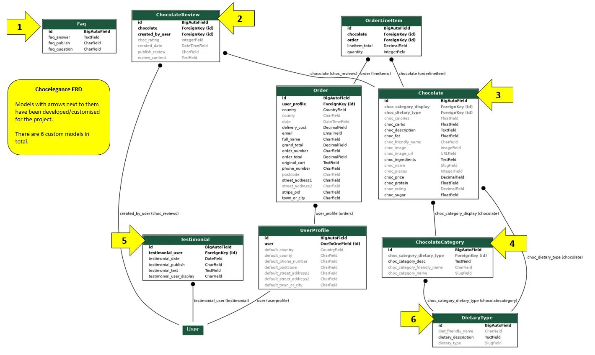
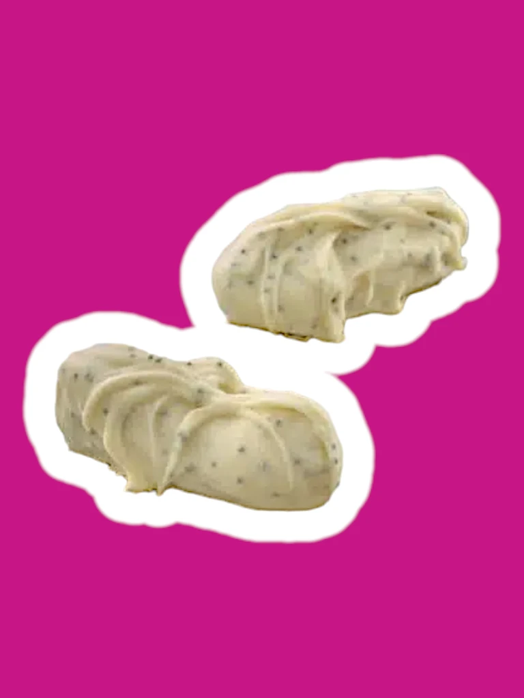

## Chocelegance

 
 
 

## Table of Contents

* [Introduction](#introduction)
* [Business Overview](#business-overview)
* [Design](#design)
* [User Stories](#user-stories)
* [Features](#features)
* [Bugs](#bugs)
* [Manual Testing](#manual-testing)
* [Deployment](#deployment)
* [Technologies Used](#technologies-used)
* [Credits](#credits)
* [Acknowledgements](#acknowledgements)

 
 

## Introduction

Chocelegance is the 5th and final project submission as part of the Code Institute DIploma in Full Stack Software Development.
  
The project is an e-Commerce platform that allows an artisan chocolatier to sell hand crafted chocolates for customers with specific dietary requirements (such as Keto, Vegan and Gluten-Free).
  
The features include the ability to make purchases directly from the site, registering a user profile, user email verification, generating email confirmations upon successful purchases, user ratings and reviews, displaying testimonials and frequently asked questions, security protocols preventing access to unauthorised views/pages and CRUD functionality for superusers.
  
The site was built using the Django framework, Python, HTML 5, CSS 3, Javascript, Bootstrap, Heroku, ElephantSQL, Stripe and AWS.
  
A link to the deployed site can be found [here](https://chocelegance-resubmission-4fbe05dd3cfa.herokuapp.com/).
  
A link to the admin panel of the deployed site can be found [here](https://chocelegance-resubmission-4fbe05dd3cfa.herokuapp.com/admin) (credentials provided in submission form).
  

[Back to Top](#chocelegance)

 
 
 

## Business Overview

An overview of the business model, competitors, SEO and marketing strategy is included below.

  
<b> Business Model </b>

 

Chocelegance is an online B2C operation offering hand crafted, diet friendly chocolates to customers with specialised dietary requirements.
  
The business is operated by a sole artisan chocolatier who has a passion for the nuances involved in fine chocolate making, and wants to share this passion with a niche set of customers that are not well served by the current offerings on the market.
  
A typical customer persona is a chocolate lover who wants to experience the rich taste of hand made chocolates, but needs to stay within a strict set of dietary parameters.
  
The business is currently at a small scale, with limited inventory being kept on hand. Chocolates will be made to order, as demand grows, a more sophisticated inventory management system will be implemented to faciliate scalable growth.
 
 
 

  
<b> Competitors </b>

 

There are several chocolate makers in the Netherlands with an online presence and established customer base. These are well entrenched competitiors with diverse product ranges. Some examples are listed below:
 

[Vanroselen](https://www.vanroselen.nl/)
 

[Ganache](https://www.ganacheamsterdam.com/)
 

[Artichoc](https://artichoc.nl/)
 

[Candela](https://chocolade-versturen.nl/)
 

[Puccini](https://puccinibomboni.com/)
  
All of these competitors offer high quality chocolates, however, they do not target customers with specific dietary requirements exclusively. The goal of Chocelegance is to capture this segement of the market and focus exclusively on serving their needs.
  
Of the competitors listed above, [Puccini](https://puccinibomboni.com/) has been used as a source of inspiration for the Chocelegance site. The images and descriptions present on their site have been used for the purposes of this project, the chocolate images and names have been fully customised for the project, however the chocolate descriptions and the text in the about page are almost entirely a direct copy from their site.
  
All images used have been credited in the credits section.
 
 

  
<b> Keyword Research </b>

 

A list of broad general topics relevant to the business was created, then lists of short-tail and long-tail keywords were created and reviewed.
  
These keywords were then rationalised to remove any that Chocelegance would not have any authority on.
  
The remaining keywords were then checked in [wordtracker.com](https://www.wordtracker.com/) for relevance, see screenshot below.
  

<table>
<tr>
<td>

</td>
</tr>
</table>
 

An example of the keyword research on [wordtracker.com](https://www.wordtracker.com/) is shown below.
  

<table>
<tr>
<td>

</td></tr></table>
 
 
 

  
<b> SEO Improvements </b>

 
The keywords identified during the research stage have been incorporated throughout the site (e.g in headings, product descriptions, between strong tags etc).
  
An example is the hero section, which includes an SEO optimised heading and button containing keywords in an organic manner (as opposed to stuffing, or keyword spamming).
  
<table>
<tr>
<td>

</td>
</tr>
</table>
 
The SEO keywords have been included in the head of the base.html file, in the <b>'keywords'</b> and <b>'description'</b> meta tags to further improve the SEO aspect of the site.
  

 
 
A <b>sitemap.xml</b> file has been included in the root directory of the project that will allow search engine spiders to identify and crawl through the site's pages.
 
 
A <b>robots.txt</b> file has also been added to the root directory of the project that will define what areas of the site are accessible to search engine spiders.

 
 
 

<b> Marketing </b>

 
As Chocelegance is currently a small operation, the preference is to leverage cost-effective marketing strategies that are suitable for a limited budget.
  
The marketing strategy will initially include a newsletter subscription, and a Facebook page. Content will be published on a weekly basis, with the goal of creating rich and engaging media that has the potential to be organically 'shareable' on social media.
  

  <i>Newsletter</i> 

 
A newsletter sign up form has been added to the footer of the site, and a Mailchimp campaign has been created to capture the subscriber email addresses.
  
Once a user subscribes, their email address is saved to the campaign.
  

<table>
<tr>
<th>
Newsletter Signup Form
</th>
</tr>

<tr>
<td>

</td>
</tr>
</table>

 

The campaign in Mailchimp stores all user email addresses to be included in future newsletter publications.

 
<table>
<tr>
<th>
Mailchimp Campaign
</th>
</tr>

<tr>
<td>

</td>
</tr>
</table>

 
 
 

  <i>Facebook Page</i> 

 
A Facebook page was set up as part of the marketing strategy.
  
This page will serve as a way to promote the business by sharing relevant communications and promotions with potential customers.
  
It will also serve as a way for customers to contact Chocelegance directly with any queries.
  

The page can be found [here](https://www.facebook.com/profile.php?id=61561170177708).
  
In the event that the page is deleted, a full screen capture is available below.
  

   <i>Facebook page screen capture</i>

 
<table>
<tr>
<td>

</td>
</tr>
</table>

[Back to Business Overview](#business-overview)
 
 
 

 

[Back to Top](#chocelegance)

<!--------------------------------------------------------------------------------------------------------------------------------------------------------------------------------------------------------------------------------- DESIGN SECTION -->
 
 
 

## Design 

An overview of the key design aspects is included below.

  
<b> Colour Scheme </b>

 
4 primary colours are used throughout the site, these colours were chosen based on appropriateness, aesthetics and accessibility.
 
 

<!-- Table showing the 4 primary colour details -->
<table>
<tr><th>Colour</th><th>Details</th></tr>

<tr>
<td>
 

  
</td>
<td>Purple  Hex: #551b8c  Primary colour used thoughout site for text, borders, container backgrounds and buttons.</td>
</tr>

<tr><td>
 

  
</td><td> Light Purple  Hex: #882bde  Used for secondary button actions.</td></tr>

<tr><td>
 

  
</td><td>Bright Purple/Violet  Hex: #c71585  Used for chocolate containers, text highlights and button glow effects.</td></tr>

<tr><td>
 

  
</td><td>Light Violet/Pink  Hex: #ed82ed  Used for box shadows and glow effects.</td></tr>

</table>

 
Purple has a traditional association with chocolate which can be seen in popular brands such as Cadbury and Milka (which are two of my favourites!).
  
The more vibrant shades of bright purple/violet have associations with romance, as exemplified by tradional Valentine's day colour schemes.
  

<!-- Table showing brand examples to justify colour scheme -->
<table>
<tr><th>Cadbury Brand</th><th>Milka Brand</th><th>Valentine's Day Example</th></tr>

<tr>
<td>

</td>

<td>

</td>

<td>

</td>
</tr>
</table>

[Back to Design](#design)
 
 
 

<!-- Colour scheme section section ends above this line -->

<b> Font </b>

 
<table>
<tr><th> Urbanist </th></tr>
<tr><td>
The site uses the 'Urbanist' font from Google Fonts.
 
 
This font was chosen as I felt it's appearance was clean, crisp, modern and consistent with the Chocelegance brand.
 
</td></tr>
<tr><td>

</td></tr>
</table> 

[Back to Design](#design)
 
 
 

<!-- Font section ends above this line -->

  
<b> Responsiveness </b>

 
<table>
<tr><th> <b>Am I Responsive?</b> </th></tr>
<tr>
<td>
The site was designed following the principles of mobile first design. All initial CSS and Bootstrap style rules were implemented for use on mobile devices with a min-width screen size of 320px, from there the layout was adapted as needed for progressively larger screens using media queries.
 
 
The screenshot below was taken from the site:
 
 
https://ui.dev/amiresponsive
 
 
</td>
</tr>

<tr>
<td>

</td>
</tr>
</table> 

[Back to Design](#design)
 
 
 

<!-- Responsiveness section ends above this line -->

  
<b> Wireframes </b>

 

<!-- Wireframe begins -->

  
  
 Sign Up Page 
  <!-- whitespace character used in heading '  ' to add indentation -->
 

<!-- Wireframe ends -->

<!-- Wireframe begins -->

  
  
 Email Verification Page 
  <!-- whitespace character used in heading '  ' to add indentation -->
 

<!-- Wireframe ends -->

<!-- Wireframe begins -->

  
  
 Confirm Email Page 
  <!-- whitespace character used in heading '  ' to add indentation -->
 

<!-- Wireframe ends -->

<!-- Wireframe begins -->

  
  
 Sign In Page 
  <!-- whitespace character used in heading '  ' to add indentation -->
 

<!-- Wireframe ends -->

<!-- Wireframe begins -->

  
  
 Home Page 
  <!-- whitespace character used in heading '  ' to add indentation -->
 

<!-- Wireframe ends -->

<!-- Wireframe begins -->

  
  
 Main Chocolates Menu 
  <!-- whitespace character used in heading '  ' to add indentation -->
 

<!-- Wireframe ends -->

<!-- Wireframe begins -->

  
  
 Chocolate Details Page 
  <!-- whitespace character used in heading '  ' to add indentation -->
 

<!-- Wireframe ends -->

<!-- Wireframe begins -->

  
  
 Shopping Cart 
  <!-- whitespace character used in heading '  ' to add indentation -->
 

<!-- Wireframe ends -->

<!-- Wireframe begins -->

  
  
 Checkout Page 
  <!-- whitespace character used in heading '  ' to add indentation -->
 

<!-- Wireframe ends -->

<!-- Wireframe begins -->

  
  
 Order Confirmation 
  <!-- whitespace character used in heading '  ' to add indentation -->
 

<!-- Wireframe ends -->

<!-- Wireframe begins -->

  
  
 Add Chocolate Page 
  <!-- whitespace character used in heading '  ' to add indentation -->
 

<!-- Wireframe ends -->

<!-- Wireframe begins -->

  
  
 Edit Chocolate Page 
  <!-- whitespace character used in heading '  ' to add indentation -->
 

<!-- Wireframe ends -->

<!-- Wireframe begins -->

  
  
 About Page 
  <!-- whitespace character used in heading '  ' to add indentation -->
 

<!-- Wireframe ends -->

<!-- Wireframe begins -->

  
  
 User Profile Page 
  <!-- whitespace character used in heading '  ' to add indentation -->
 

<!-- Wireframe ends -->
 
 
 

<!-- Wireframe section ends above this line -->

  
<b> Entity Relationship Diagram </b>

 

<table>
<tr>
<th>
ERD
</th>
</tr>

<tr>
<td>

The project uses [ElephantSQL](https://www.elephantsql.com/) to host the database.
  
6 custom database models have been developed to capture and store relevant data:
 

<ol>
<li>
<b>Faq Model</b>
 
This model holds the questions and answers that are displayed to the user in the 'About' page. This content is updated by the superuser directly from the admin panel. Located in 'About' app.
</li>
 
<li>
<b>ChocolateReview Model</b>
 
This model holds the chocolate reviews that are added by the user in the chocolate details page. The reviews are submitted with the 'publish' status set to 'No', once reviewed by the superuser in the admin panel, the 'publish' status can then be set to 'Yes', which will trigger the review to be displayed on the site. Located in 'Chocolate' app.
</li>
 
<li>
<b>Chocolate Model</b>
 
This model holds all the relevant details about the chocolates sold on the site. The values in this model can be created, read, updated, and deleted by a superuser directly from the site without the need to log in to the admin panel. Located in 'Chocolate' app.
</li>
 
<li>
<b>ChocolateCategory Model</b>
 
This model holds the different categories of chocolates sold on the site (e.g Dark Vegan Chocolate, Milk Gluten-Free Chocolate etc). These values are updated from the admin panel. Located in 'Chocolate' app.
</li>
 
<li>
<b>Testimonial Model</b>
 
This model holds the testimonials that are injected into the home page carousel. This content is updated in the admin panel by a superuser. Located in 'Testimonials' app.
</li>
 
<li>
<b>DietaryType Model</b>
 
This model holds the different dietary types that are catered to (e.g Keto, Vegan, Gluten-Free). This content is updated in the admin panel by a superuser. Located in 'Chocolate' app.
</li>
</ol>

 
The ERD below was generated using graphviz.
 
 
</td>
</tr>

<tr>
<td>

</td>
</tr>

</table>

[Back to Design](#design)
 
 
 

 

[Back to Top](#chocelegance)

<!--------------------------------------------------------------------------------------------------------------------------------------------------------------------------------------------------------------------------------- FEATURES SECTION -->
 
 
 

## Features

## User Stories

## Manual Testing

Responsive, browser compatibility, bugs (resolved and unresolved), Lighthouse testing, code validation, user story testing, features testing.

### Resolved Bugs

When trying to install Django AllAuth 0.41.0 I ran into the error message below 
"Python setup.py egg_info did not run successfully when installing" 
This was preventing me from installing the correct AllAuth package, after trying different approaches such as installing different versions of Django and Python, I found a post that suggested installing a specific version of 'Setuptools', I installed Setuptools version 67.4.0 which appears to have resolved the issue regarding the AllAuth installation

https://github.com/openai/openai-cookbook/issues/154

 

[Back to Top](#chocelegance)

<!--------------------------------------------------------------------------------------------------------------------------------------------------------------------------------------------------------------------------------- TECHNOLOGIES USED -->
 
 
 

## Technologies Used 

An overview of the technologies used throughout the development of the project is shown below.

#### 
<table>
<tr><th>Logo</th><th>Name</th><th>Primary Role</th><th>Link</th></tr>
<!-- spacer -->
<tr><td>

	<code></code>

</td>
<td>Django</td>
<td>Site Framework</td>
<td>https://www.djangoproject.com/</td>
</tr>
<!-- spacer -->
<!-- spacer -->
<tr><td>

	<code></code>

</td>
<td>Python</td>
<td>Site logic</td>
<td>https://www.python.org/</td>
</tr>
<!-- spacer -->
<!-- Technology Used 1 begins -->
<tr><td>

	<code></code>

</td>
<td>Javascript</td>
<td>Site interaction</td>
<td>https://developer.mozilla.org/en-US/docs/Web/JavaScript</td>
</tr>
<!-- Technology Used 1 ends -->
<tr><td>

	<code></code>

</td>
<td>HTML 5</td>
<td>Site structure</td>
<td>https://dev.w3.org/html5/spec-LC/</td>
</tr>
<!-- spacer -->
<tr><td>

	<code></code>

</td>
<td>CSS 3</td>
<td>Site Styling</td>
<td>https://www.w3.org/TR/2001/WD-css3-roadmap-20010523/</td>
</tr>
<!-- spacer -->
<!-- spacer -->
<tr><td>

	<code></code>

</td>
<td>Bootstrap</td>
<td>CSS/Javascript Styling Framework</td>
<td>https://getbootstrap.com/</td>
</tr>
<!-- spacer -->
<tr><td>

	<code></code>

</td>
<td>Github</td>
<td>Site repository</td>
<td>https://docs.github.com/en</td>
</tr>
<!-- spacer -->
<tr><td>

	<code></code>

</td>
<td>Gitpod</td>
<td>Site development, IDE</td>
<td>https://www.gitpod.io/docs/introduction</td>
<!-- spacer -->
<tr><td>

	<code></code>

</td>
<td>ElephantSQL</td>
<td>Database hosting</td>
<td>https://www.elephantsql.com/</td>
</tr>
<!-- spacer -->
</tr>
<!-- spacer -->
<tr><td>

	<code></code>

</td>
<td>Heroku</td>
<td>App deployment/hosting</td>
<td>https://www.heroku.com</td>
</tr>
<!-- spacer -->
<tr><td>

	<code></code>

</td>
<td>Amazon Web Services</td>
<td>Media & Static file hosting</td>
<td>https://aws.amazon.com/<td>
</tr>
<!-- spacer -->
<!-- spacer -->
<tr><td>

	<code></code>

</td>
<td>Stripe</td>
<td>Payment Processing</td>
<td>https://www.stripe.com/<td>
</tr>
<!-- spacer -->
<!-- spacer -->
<tr><td>

	<code></code>

</td>
<td>Mailchimp</td>
<td>Newsletter Marketing</td>
<td>https://www.mailchimp.com/<td>
</tr>
<!-- spacer -->
<!-- Technology Used 1 ends -->
<tr><td>

	<code></code>

</td>
<td> Code Institute Python Linter  </td>
<td>Python PEP8 validation</td>
<td>https://pep8ci.herokuapp.com/#</td>
</tr>
<!-- spacer -->
<tr><td>

	<code></code>

</td>
<td>W3C</td>
<td>HTML & CSS Validation</td>
<td>https://validator.w3.org/docs/</td>
</tr>
<!-- spacer -->
<tr><td>

	<code></code>

</td>
<td>JSHint</td>
<td>Javascript Validation</td>
<td>https://jshint.com/docs/</td>
</tr>
<!-- spacer -->
<tr><td>

	<code></code>

</td>
<td>Balsamiq</td>
<td>Wireframing</td>
<td>https://balsamiq.com/docs/</td>
</tr>
<!-- spacer -->

<tr><td>

	<code></code>

</td>
<td>Coffee</td>
<td>Soul Enhancer</td>
<td>https://en.wikipedia.org/wiki/Coffee</td>
</tr>
<!-- spacer -->
<tr><td>

	<code></code>

</td>
<td>Google</td>
<td>Brain Enhancer</td>
<td>https://www.google.com/</td>
</tr>
<!-- spacer -->
</table>
<!-- Technologies Used section ends here -->

[Back to Top](#chocelegance)
 
 
 

## Deployment

Prerequisties, installs, IDE, deployments, forking, cloning, heroku, AWS, Stripe.

[Back to Top](#chocelegance)

<!--------------------------------------------------------------------------------------------------------------------------------------------------------------------------------------------------------------------------------- Required Installs-->
 
 
 

### Required Installs

Django 3.2.25 
Django AllAuth 0.14.0 
asgiref==3.8.1 
django-crispy-forms==1.14.0 
oauthlib==3.2.2 
pillow==10.3.0 
python3-openid==3.2.0 
pytz==2024.1 
requests-oauthlib==2.0.0 
setuptools==67.4.0 
sqlparse==0.5.0 
stripe==9.9.0 

[Back to Top](#chocelegance)

<!--------------------------------------------------------------------------------------------------------------------------------------------------------------------------------------------------------------------------------- CREDITS SECTION -->
 
 
 

## Credits

An overview of materials referenced and images used during the development of the project is shown below.

<!-- The Credits section is shown below, this will be disaplyed in a collapsible format, with a sub section for reference content/materials and a sub section for images, with each item shown in tabular form -->

    
<b>Reference Materials Used</b>

 
<table>
<tr><th><b> Description </b></th><th><b> Link </b></th></tr>
<!-- Reference Material 1 begins -->
<tr><td> Code Institute 'Boutique Ado' Walkthrough Project </td>
<td> 

[here](https://codeinstitute.net/) 

</td></tr>
<!-- Reference Material 1 ends -->
<tr><td> Code Institute PP5 Walkthrough Video, by Kasia Bogucka</td>
<td> 

[here](https://youtu.be/i7clFOYiwS0)  

</td></tr>
<!-- spacer -->
<tr><td> Code Institute README.md guide, by Kasia Bogucka</td>
<td> 

[here](https://youtu.be/l1DE7L-4eKQ?si=YlDWOkkzvTBjbgs3)

</td></tr>
<!-- spacer -->
<tr><td> Code Institute E-Commerce Guide to MVP, by Kasia Bogucka </td>
<td> 

[here](https://youtu.be/i7clFOYiwS0) 

</td></tr>
<!-- spacer -->
<tr><td> Chocolate descriptions, about texxt and images used across site, www.puccinibomboni.com </td>
<td> 

[here](https://puccinibomboni.com/)

</td></tr>
<!-- spacer -->
<tr><td> Guide on using the transform property, published by geeksforgeeks.org </td>
<td> 

[here](https://www.geeksforgeeks.org/how-to-rotate-an-html-div-element-90-degrees-using-javascript/)

</td></tr>
<!-- spacer -->
<tr><td> Boostrap carousel implentation in Django, by Stackoverflow user simopopov </td>
<td> 

[here](https://stackoverflow.com/questions/27219078/bootstrap-carousel-implementation-in-django)  

</td></tr>
<!-- spacer -->
<tr><td> Advice on Python 'setup.py egg_info' error, by Github user ocona </td>
<td> 

[here](https://github.com/openai/openai-cookbook/issues/154)  

</td></tr>
<!-- spacer -->
<tr><td> Slide effect on bootstrap dropdown menus, by Stackoverflow user cogell </td>
<td> 

[here](https://stackoverflow.com/questions/12115833/adding-a-slide-effect-to-bootstrap-dropdown)  

</td></tr>
<!-- spacer -->
<tr><td> How to style a checkbox, published by www.sentry.io </td>
<td> 

[here](https://sentry.io/answers/how-to-style-a-checkbox-using-css/)

</td></tr>
<!-- spacer -->
<tr><td> How to style a Bootstrap accordion, by Stackoverflow user Sahil Dhir </td>
<td> 

[here](https://stackoverflow.com/questions/75398511/style-header-of-bootstrap-accordion-that-has-the-class-collapse-show)  

</td></tr>
<!-- spacer -->
<tr><td> Text used for user testimonials, published by www.thehappychocolatier.com </td>
<td> 

[here](https://www.thehappychocolatier.com/testimonials/)

</td></tr>
<!-- spacer -->
<tr><td> Change style of carousel control buttons, by Stackoverflow user nifoem bar </td>
<td> 

[here](https://stackoverflow.com/questions/46249541/change-arrow-colors-in-bootstraps-carousel)  

</td></tr>
<!-- spacer -->
<tr><td> Code used for spherical shading on main button developed by 'The Anonymous Koder' </td>
<td> 

[here](https://codepen.io/theanonymouskoder/pen/PomjmeY?editors=1100)  

</td></tr>
<!-- spacer -->
<tr><td> Thread on hiding parent elements with onclick function, by Stackoverflow user DextrousDave </td>
<td> 

[here](https://stackoverflow.com/questions/17399897/hide-parent-element-with-onclick-function)

</td></tr>
<!-- spacer -->
<tr><td> Tutorial on creating product reviews in Django, by YouTube channel 'Code With Stein' </td>
<td> 

[here](https://www.youtube.com/watch?v=8iCqlFyFu2s)

</td></tr>
<!-- spacer -->
</td></tr>
<tr><td> Rounding a value in a DTL variable, by Stackoverflow user arulmr </td>
<td> 

[here](https://stackoverflow.com/questions/18185351/how-can-i-round-a-value-in-django-template-without-using-the-filter)

</td></tr>
<!-- spacer -->
<tr><td> Text used for FAQs section in About page, published by www.chocolatecompany.nl </td>
<td> 

[here](https://www.chocolatecompany.nl/en/service/faq/) 

</td></tr>
<!-- spacer -->
<tr><td> Code Institute README.md Template, published by Code Institute </td>
<td> 

[here](https://github.com/Code-Institute-Solutions/readme-template)  

</td></tr>
<!-- spacer -->
<tr><td> Github README.md Markdown Guide, by Github user lifeparticle </td>
<td> 

[here](https://github.com/lifeparticle/Markdown-Cheatsheet)  

</td></tr>
<!-- spacer -->
<tr><td> Github README.md Cheatsheet, by Github user tchapi </td>
<td> 

[here](https://github.com/tchapi/markdown-cheatsheet/blob/master/README.md)

</td></tr>
<!-- spacer -->
<tr><td> The hex values of the Github background colour were obtained using imagecolorpicker.com </td>
<td> 

[here](https://imagecolorpicker.com/en)

</td></tr>
<!-- spacer -->
<tr><td> How to create anchor links in README.md, by Github user Rachel Hyman </td>
<td> 

[here](https://gist.github.com/rachelhyman/b1f109155c9dafffe618)  

</td></tr>
<!-- spacer -->
<tr><td> How to add collapsible items to README.md, by Github user pierrejoubert73 </td>
<td> 

[here](https://gist.github.com/pierrejoubert73/902cc94d79424356a8d20be2b382e1ab)

</td></tr>
<!-- spacer -->
</td></tr>
<tr><td> Advice to add documentation folder to README.md, Code Institute Slack message by Kera Cudmore </td>
<td> 

[here](https://code-institute-room.slack.com/archives/C01UE4ND3H7/p1701601763768449?thread_ts=1701600346.836459&cid=C01UE4ND3H7)

</td></tr>
<!-- spacer -->
<tr><td> How to add a tickmark to README.md, by Stackoverflow user Waylan </td>
<td> 

[here](https://stackoverflow.com/questions/54694160/adding-checkbox-in-markdown-table-does-not-work)

</td></tr>
<!-- spacer -->
<tr><td> Sticky footer guide, published by www.css-tricks.com </td>
<td> 

[here](https://css-tricks.com/a-clever-sticky-footer-technique/)

</td></tr>
<!-- spacer -->
<tr><td> Site used to convert png to favicon, favicon.io </td>
<td> 

[here](https://realfavicongenerator.net/)

</td></tr>
<!-- spacer -->
<tr><td> Guide to making atomic git commits, by Aleksandr Hovhannisyan </td>
<td> 

[here](https://www.aleksandrhovhannisyan.com/blog/atomic-git-commits/)

</td></tr>
<!-- spacer -->
<tr><td> Library of front end icons used for README.md, by Github user marwin1991 </td>
<td> 

[here](https://marwin1991.github.io/profile-technology-icons/)

</td></tr>
<!-- spacer -->
<tr><td> Site containing open source icons used for README.md, published by iconduck.com </td>
<td> 

[here](https://iconduck.com/)

</td></tr>
<!-- spacer -->
<tr><td> Site used to convert svg to png, svgtopng.com </td>
<td> 

[here](https://svgtopng.com/)

</td></tr>
<!-- spacer -->
<tr><td> How to make a cell span a row, used in README.md, by Stackoverflow user Nisse Engström </td>
<td> 

[here](https://stackoverflow.com/questions/26400006/make-a-td-span-the-entire-row-in-a-table)

</td></tr>
<!-- spacer -->
<tr><td> Site used to generate sitemap.xml </td>
<td> 

[here](https://www.xml-sitemaps.com/)

</td></tr>
<!-- spacer -->
<tr><td> Adding admin panel to a DTL url, by Stackoverflow user Arpit Solanki </td>
<td> 

[here](https://stackoverflow.com/questions/45122421/refer-to-admin-site-using-url-admin-in-app-django)

</td></tr>
<!-- spacer -->
<tr><td> Udemy Masterclass course, by instructor Ashutosh Pawar </td>
<td> 

[here](https://uber.udemy.com/course/django-course/learn/lecture/16355734#overview)

</td></tr>
<!-- spacer -->
<tr><td> Guide on the syntax for CSS animations, published by w3schools.com </td>
<td> 

[here](https://www.w3schools.com/cssref/css3_pr_animation.php)

</td></tr>
<!-- spacer -->
<tr><td> Solution to Django email error (runtime.txt fix), in Code Institute Slack channel, by Roman Rakic </td>
<td> 

[here](https://code-institute-room.slack.com/archives/C026VTHQDNY/p1711548670431029?thread_ts=1711547601.933219&cid=C026VTHQDNY)

</td></tr>
<!-- spacer -->
<tr><td> Tips on installing GraphViz, in Code Institute Slack channel, by Sean Young_Hackteam
 </td>
<td> 

[here](https://code-institute-room.slack.com/archives/C7HS3U3AP/p1618224655315000?thread_ts=1618179147.312700&cid=C7HS3U3AP)

</td></tr>
<!-- spacer -->
<tr><td> Tips on saving favicon in static folder, in Code Institute Slack channel, by Jo Heyndels
 </td>
<td> 

[here](https://code-institute-room.slack.com/archives/C7EJUQT2N/p1667981758347029?thread_ts=1667981265.461969&cid=C7EJUQT2N)

</td></tr>
<!-- spacer -->
<tr><td> Tips on fixing JS quantity form bug, in Code Institute Slack channel, by Ed Bradley
 </td>
<td> 

[here](https://code-institute-room.slack.com/archives/C7EJUQT2N/p1668538758607109?thread_ts=1668535011.445709&cid=C7EJUQT2N)

</td></tr>
<!-- spacer -->
<tr><td> How to set max and min validators in model field, by Stackoverflow user Tom
 </td>
<td> 

[here](https://stackoverflow.com/questions/42425933/how-do-i-set-a-default-max-and-min-value-for-an-integerfield-django)

</td></tr>
<!-- spacer -->
<tr><td> How to allow only positive decimal numbers in model field, by Stackoverflow user Alasdair
 </td>
<td> 

[here](https://stackoverflow.com/questions/12384460/allow-only-positive-decimal-numbers)

</td></tr>

<!-- TABLE ENDS BELOW THIS LINE! -->
</table>
 
 
 

<!-- Reference Materials credits section ends here -->

<!-- The Images sub section is shown below, this will be disaplyed in a collapsible format, with each item shown in tabular form, the images represent thumbnails of the actual pictures used on the live site (they've been scaled down to 10% of the original size, approx 50px by 50px) -->

  
<b>Images</b>

 

<table>
<tr><th><b> Image </b></th><th><b> Production File Name </b></th><th><b> Source </b></th></tr>
<!-- image 1 begins -->
<tr><td width="50">

</td>
<td>dark-choc-gluten-free-coffee-date-final</td>

<td>

[here](https://puccinibomboni.com/en/bonbon/coffee)
</td>
</tr>
<!-- image 1 ends -->
<tr><td width="50">

</td>
<td>dark-choc-gluten-free-cognac-crown-final</td>

<td>

[here](https://puccinibomboni.com/en/bonbon/cognac)
</td>
</tr>
<!-- spacer -->
<tr><td width="50">

</td>
<td>milk-choc-gluten-free-cranberry-zombie-final</td>

<td>

[here](https://puccinibomboni.com/en/bonbon/cranberry)
</td>
</tr>
<!-- spacer -->
<tr><td width="50">

</td>
<td>milk-choc-gluten-free-manjari-magic-final</td>

<td>

[here](https://puccinibomboni.com/en/bonbon/manjari)
</td>
</tr>
<!-- spacer -->
<tr><td width="50">

</td>
<td>white-choc-gluten-free-currant-crunch-final</td>

<td>

[here](https://puccinibomboni.com/en/bonbon/rum-currant)
</td>
</tr>
<!-- spacer -->
<tr><td width="50">

</td>
<td>white-choc-gluten-free-vanilla-victory-final</td>

<td>

[here](https://puccinibomboni.com/en/bonbon/vanilla-poppyseed)
</td>
</tr>
<!-- spacer -->
<tr><td width="50">

</td>
<td>dark-choc-keto-amarena-delight-final</td>

<td>

[here](https://puccinibomboni.com/en/bonbon/amarena-cherry)
</td>
</tr>
<!-- spacer -->
<tr><td width="50">

</td>
<td>dark-choc-keto-caramel-fusion-final</td>

<td>

[here](https://puccinibomboni.com/en/bonbon/caramel)
</td>
</tr>
<!-- spacer -->
<tr><td width="50">

</td>
<td>milk-choc-keto-apple-embrace-final</td>

<td>

[here](https://puccinibomboni.com/en/bonbon/apple)
</td>
</tr>
<!-- spacer -->
<tr><td width="50">

</td>
<td>milk-choc-keto-plum-paradise-final</td>

<td>

[here](https://puccinibomboni.com/en/bonbon/plum)
</td>
</tr>
<!-- spacer -->
<tr><td width="50">

</td>
<td>white-choc-calvados-final</td>

<td>

[here](https://puccinibomboni.com/en/bonbon/calvados)
</td>
</tr>
<!-- Miss Images end here -->
<!-- Goal Images start here -->
<tr><td width="50">

</td>
<td>white-choc-limoncello-liaison-final</td>

<td>

[here](https://puccinibomboni.com/en/bonbon/limoncello)
</td>
</tr>
<!-- spacer -->
<tr><td width="50">

</td>
<td>dark-choc-vegan-thyme-adventure-updated</td>

<td>

[here](https://puccinibomboni.com/en/bonbon/thyme)
</td>
</tr>
<!-- spacer -->
<tr><td width="50">

</td>
<td>dark-choc-vegan-walnut-wonder-updated</td>

<td>

[here](https://puccinibomboni.com/en/bonbon/walnut)
</td>
</tr>
<!-- spacer -->
<tr><td width="50">

</td>
<td>milk-choc-vegan-pepper-surprise-updated</td>

<td>

[here](https://puccinibomboni.com/en/bonbon/pepper)
</td>
</tr>
<!-- spacer -->
<tr><td width="50">

</td>
<td>milk-choc-vegan-plush-pecan-updated</td>

<td>

[here](https://puccinibomboni.com/en/bonbon/pecan)
</td>
</tr>
<!-- spacer -->
<tr><td width="50">

</td>
<td>white-choc-vegan-currant-affair-updated</td>

<td>

[here](https://puccinibomboni.com/en/bonbon/rum-currant)
</td>
</tr>
<!-- spacer -->
<tr><td width="50">

</td>
<td>white-choc-vegan-villianous-vanilla-updated</td>

<td>

[here](https://puccinibomboni.com/en/bonbon/vanilla-poppyseed)
</td>
</tr>
<!-- spacer -->
<tr><td width="50">

</td>
<td>hero-image</td>

<td>

[here](https://www.freepik.com/free-photo/closeup-shot-chocolate-candy-isolated_15520864.htm#fromView=search&page=1&position=50&uuid=eb6bdc3a-bad6-494e-adec-5352ef9d1007)
</td>
</tr>
<!-- spacer -->

<!-- spacer -->
</table>
 
 
 

<!-- Images credits end here -->

 

[Back to Top](#chocelegance)

<!--------------------------------------------------------------------------------------------------------------------------------------------------------------------------------------------------------------------------------- ACKNOWLEDGEMENTS SECTION -->
 
 
 

## Acknowledgements
